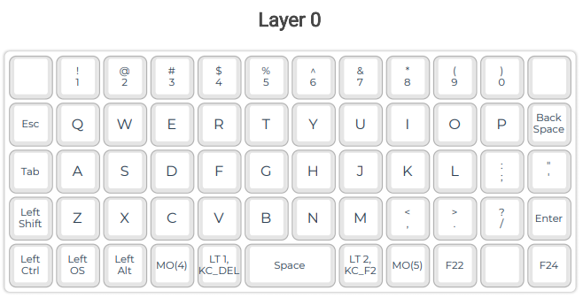
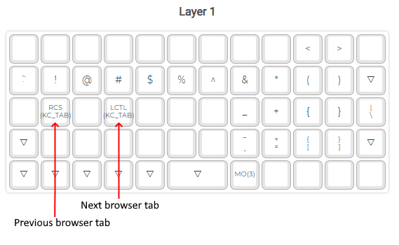
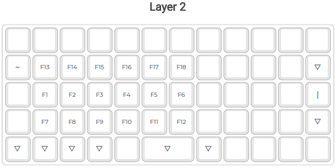
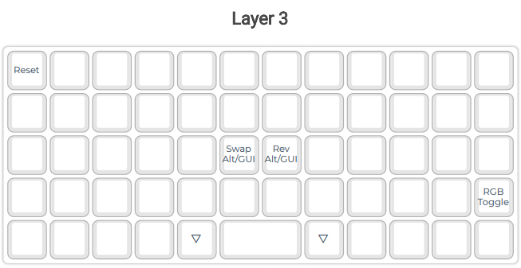
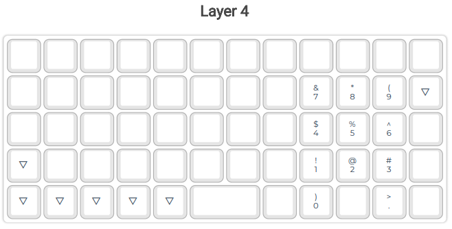
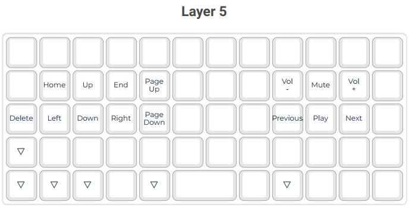

# My Preonic keymap

## How to build
- Copy "qitbit" folder into wherever QMK MYSY installs "qmk_firmware". Default should be in your %USERPROFILE% folder
- Run the following command in QMK MYSY

    `qmk compile --keyboard preonic/rev3 --keymap qitbit`

- The compiled keymap by default should be located in "%USERPROFILE%\qmk_firmware\\.build"

## Layout

