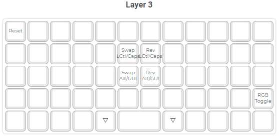

# My Preonic keymap

## How to build

- Copy "qitbit" folder into '%USERPROFILE%\qmk_firmware\keyboards\preonic\keymaps' folder.

- Run the following command in QMK MYSY

    `qmk compile --keyboard preonic/rev3 --keymap qitbit`

- The resulting compiled keymap should by default be located in "%USERPROFILE%\qmk_firmware\\.build"

## Details about this keymap
- has a dedicated numpad layer under right hand
- has a dedicated navigation layer that is located under left hand at wasd

## Layout

Solarized dark             |  Solarized Ocean
:-------------------------:|:-------------------------:
  |    |    |    |    |    |    |    |    |    |    |  